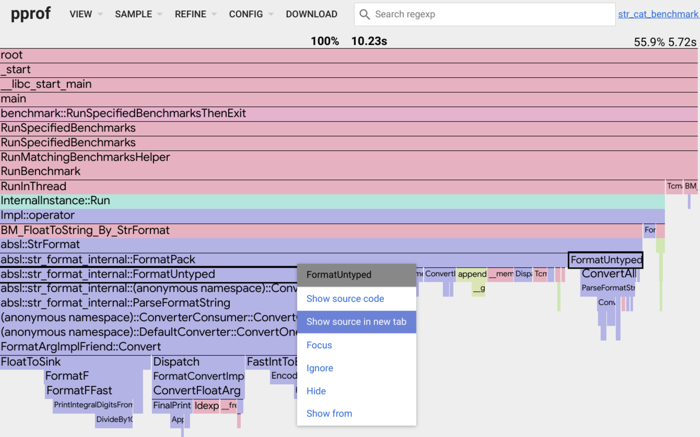
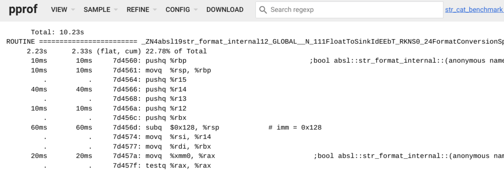
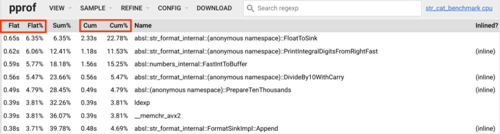

# pprof

pprof — это инструмент для визуализации и анализа данных профилирования.

pprof считывает коллекцию сэмплов профилирования в формате profile.proto и
генерирует отчеты для визуализации и помощи в анализе данных. Он может создавать как
текстовые, так и графические отчеты (с использованием пакета визуализации dot).

profile.proto — это protocol buffer, описывающий набор стеков вызовов
и информацию для символизации. Обычно он используется для представления набора
сэмплированных стеков вызовов из статистического профилирования. Формат
описан в файле proto/profile.proto. Подробнее о protocol buffers см. https://developers.google.com/protocol-buffers

Профили можно читать из локального файла или по http. Несколько
профилей одного типа можно агрегировать или сравнивать.

Если сэмплы профиля содержат машинные адреса, pprof может символизировать
их с помощью нативных инструментов binutils (addr2line и nm).

# Профили pprof

pprof работает с данными в формате profile.proto. Каждый профиль представляет собой коллекцию
сэмплов, где каждый сэмпл связан с точкой в иерархии местоположений,
одним или несколькими числовыми значениями и набором меток (labels). Часто эти профили представляют
данные, собранные путем статистического сэмплирования программы, поэтому каждый сэмпл
описывает стек вызовов программы и количество или значение сэмплов, собранных в
данном местоположении. pprof не зависит от семантики профиля, поэтому возможны и другие применения.
Интерпретация отчетов, генерируемых pprof, зависит от
семантики, определенной источником профиля.

# Режимы использования

Существует несколько способов использования `pprof`.

## Генерация отчета

Если формат отчета запрашивается в командной строке:

    pprof <формат> [опции] источник

pprof сгенерирует отчет в указанном формате и завершит работу.
Форматы могут быть текстовыми или графическими. Подробности о
поддерживаемых форматах, опциях и источниках см. ниже.

## Интерактивное использование в терминале

Без указания формата:

    pprof [опции] источник

pprof запустит интерактивную оболочку, в которой пользователь может вводить
команды. Введите `help` для получения онлайн-справки.

## Веб-интерфейс

Если в командной строке указан host:port:

    pprof -http=[host]:[port] [опции] источник

pprof начнет обслуживать HTTP-запросы на указанном порту. Посетите
HTTP URL, соответствующий порту (обычно `http://<host>:<port>/`),
в браузере, чтобы увидеть интерфейс.

# Детали

Цель pprof — сгенерировать отчет для профиля. Отчет
генерируется из иерархии местоположений, которая реконструируется из сэмплов
профиля. Каждое местоположение содержит два значения:

*   *flat*: значение самого местоположения.
*   *cum* (cumulative): значение местоположения плюс все его потомки.

Сэмплы, которые включают местоположение несколько раз (например, для рекурсивных функций),
учитываются только один раз для каждого местоположения.

## Опции

*опции* настраивают содержимое отчета. Каждая опция имеет значение,
которое может быть булевым, числовым или строковым. Хотя можно указать
только один формат, большинство опций можно выбирать независимо друг от
друга.

Некоторые распространенные опции pprof:

*   **-flat** [по умолчанию], **-cum**: Сортировать записи в текстовых отчетах по их значению `flat` или `cum`
    соответственно.
*   **-functions** [по умолчанию], **-filefunctions**, **-files**, **-lines**,
    **-addresses**: Генерировать отчет с указанной гранулярностью (функции, функции с файлами, файлы, строки, адреса).
*   **-noinlines**: Приписывать метрики встроенных (инлайновых) функций их первому вызывающему коду, не являющемуся инлайновым.
    Например, команда `pprof -list foo -noinlines profile.pb.gz` может быть
    использована для создания аннотированного листинга исходного кода, приписывающего метрики встроенных функций
    строке вызывающего кода, где не происходит инлайнинг.
*   **-nodecount= _int_**: Максимальное количество записей в отчете. pprof
    выведет только это количество записей и будет использовать эвристики для выбора записей для отсечения.
*   **-focus= _regex_**: Включать только сэмплы, содержащие запись отчета, соответствующую
    *regex* (регулярному выражению).
*   **-ignore= _regex_**: Не включать сэмплы, содержащие запись отчета, соответствующую
    *regex*.
*   **-show\_from= _regex_**: Не показывать записи выше первой, соответствующей
    *regex*.
*   **-show= _regex_**: Показывать только записи, соответствующие *regex*.
*   **-hide= _regex_**: Не показывать записи, соответствующие *regex*.

Каждый сэмпл в профиле может содержать несколько значений, представляющих разные
сущности, связанные с сэмплом. Отчеты pprof включают одно значение сэмпла,
которое по соглашению является последним указанным в отчете. Опция `sample_index=`
выбирает, какое значение использовать, и может быть установлена в число (от 0 до
количества значений - 1) или имя значения сэмпла.

Значения сэмплов — это числовые значения, связанные с единицей измерения. Если pprof может распознать
эти единицы, он попытается масштабировать значения до подходящей единицы для
визуализации. Опция `unit=` принудительно установит использование определенной единицы. Например,
`unit=sec` заставит все значения времени отображаться в
секундах. pprof распознает большинство распространенных единиц времени и размера памяти.

## Теги (Tags)

Сэмплы в профиле могут иметь теги. Эти теги имеют имя и значение. Значение
может быть числовым или строковым; числовые значения могут быть связаны
с единицей измерения. Теги используются как дополнительные измерения, по которым
можно разбить значения сэмплов. Наиболее распространенное использование тегов — выборка
сэмплов из профиля на основе значений тегов. pprof также поддерживает теги во время визуализации.

### Фильтрация по тегам

Опция `-tagfocus` — наиболее часто используемая опция для выбора данных в профиле
на основе значений тегов. Она имеет синтаксис **-tagfocus=_regex_** или
**-tagfocus=_range_:**, что ограничит данные сэмплами с тегами, соответствующими
регулярному выражению или находящимися в диапазоне. Опция `-tagignore` имеет идентичный синтаксис и может
использоваться для фильтрации сэмплов с соответствующими тегами. Если указаны и `-tagignore`,
и `-tagfocus`, и они оба соответствуют данному сэмплу, то сэмпл будет отброшен.

При использовании `-tagfocus=regex` и `-tagignore=regex` регулярное выражение будет сравниваться
с каждым значением, связанным с каждым тегом. Если указать значение
типа `regex1,regex2`, то будут сохранены только сэмплы со значением тега, соответствующим `regex1`,
*и* значением тега, соответствующим `regex2`.

В дополнение к возможности фильтрации по значениям тегов, можно указать имя
тега, с которым должно быть связано определенное значение, используя нотацию
`-tagfocus=tagName=value`. Здесь `tagName` должен точно совпадать с именем тега,
а значение может быть либо регулярным выражением, либо диапазоном. Если указать
значение типа `regex1,regex2`, то будут соответствовать сэмплы со значением тега (в паре с
указанным именем тега), соответствующим либо `regex1`, либо `regex2`.

Вот примеры, объясняющие, как можно использовать `-tagfocus`:

*   `-tagfocus 128kb:512kb` принимает сэмпл тогда и только тогда, когда у него есть какой-либо числовой тег со
    значением памяти в указанном диапазоне.
*   `-tagfocus mytag=128kb:512kb` принимает сэмпл тогда и только тогда, когда у него есть числовой тег
    `mytag` со значением памяти в указанном диапазоне. Нет способа указать
    `-tagfocus mytag=128kb:512kb,16kb:32kb`
    или `-tagfocus mytag=128kb:512kb,mytag2=128kb:512kb`. Только одно значение или
    диапазон для числовых тегов.
*   `-tagfocus someregex` принимает сэмпл тогда и только тогда, когда у него есть какой-либо строковый тег со
    строкой `tagName:tagValue`, соответствующей указанному регулярному выражению. В будущем это
    изменится, и сэмпл будет приниматься тогда и только тогда, когда у него есть какой-либо строковый тег со строкой `tagValue`,
    соответствующей указанному регулярному выражению.
*   `-tagfocus mytag=myvalue1,myvalue2` соответствует, если присутствует любое из двух значений тега.

### Визуализация тегов

Чтобы перечислить теги и их значения, доступные в профиле, используйте опцию **-tags**.
Она выведет доступные теги и их значения, а также разбивку
значения сэмпла по значениям каждого тега.

Отчеты графа вызовов pprof, такие как `-web` или сырой `-dot`, автоматически
визуализируют значения для всех тегов как псевдо-узлы в графе. Используйте опции `-tagshow`
и `-taghide` для ограничения отображаемых тегов. Опции принимают
регулярное выражение, которое сопоставляется с именем тега для его показа или скрытия
соответственно.

Опции `-tagroot` и `-tagleaf` можно использовать для создания псевдо-фреймов стека для
сэмплов профиля. Например, `-tagroot=mytag` добавит фреймы стека в
корне дерева вызовов профиля со значением тега для соответствующих
сэмплов. Аналогично, `-tagleaf=mytag` добавит такие фреймы стека как листовые узлы
каждого сэмпла. Эти опции полезны при визуализации профиля в древовидных форматах,
таких как представление дерева в веб-интерфейсе режима `-http`.

## Текстовые отчеты

Текстовые отчеты pprof показывают иерархию местоположений в текстовом формате.

*   **-text:** Выводит записи местоположений, по одной на строку, включая значения `flat` и
    `cum`.
*   **-tree:** Выводит каждую запись местоположения с ее предшественниками и преемниками.
*   **-peek= _regex_**: Выводит запись местоположения со всеми ее предшественниками и
    преемниками, без отсечения каких-либо записей.
*   **-traces:** Выводит каждый сэмпл с местоположением на строку.

## Графические отчеты

pprof может генерировать графические отчеты в формате DOT и преобразовывать их в
несколько форматов с помощью пакета graphviz.

Эти отчеты представляют иерархию местоположений в виде графа, где запись отчета
представлена узлом. Узлы удаляются с использованием эвристик для ограничения размера
графа, контролируемого опцией *nodecount*.

*   **-dot:** Генерирует отчет в формате .dot. Все остальные форматы генерируются
    из него.
*   **-svg:** Генерирует отчет в формате SVG.
*   **-web:** Генерирует отчет в формате SVG во временном файле и запускает веб-
    браузер для его просмотра.
*   **-png, -jpg, -gif, -pdf:** Генерирует отчет в этих форматах.

### Интерпретация графа вызовов (Callgraph)

*   **Цвет узла**:
    *   Большие положительные значения `cum` — красные.
    *   Большие отрицательные значения `cum` — зеленые; отрицательные значения чаще всего
        появляются при сравнении профилей, см. подробности в [этом разделе](#comparing-profiles).
    *   Значения `cum`, близкие к нулю, — серые.

*   **Размер шрифта узла**:
    *   Больший размер шрифта означает большие абсолютные значения `flat`.
    *   Меньший размер шрифта означает меньшие абсолютные значения `flat`.

*   **Толщина ребра**:
    *   Более толстые ребра указывают на то, что по этому пути было использовано больше ресурсов.
    *   Более тонкие ребра указывают на то, что по этому пути было использовано меньше ресурсов.

*   **Цвет ребра**:
    *   Большие положительные значения — красные.
    *   Большие отрицательные значения — зеленые.
    *   Значения, близкие к нулю, — серые.

*   **Пунктирные ребра**: некоторые местоположения между двумя соединенными узлами были
    удалены.

*   **Сплошные ребра**: одно местоположение напрямую вызывает другое.

*   **Маркер ребра "(inline)"**: вызов был встроен (inlined) в вызывающую сторону.

Рассмотрим следующий пример графа:

*   Для узлов:
    *   `(*Rand).Read` имеет небольшое значение `flat` и небольшое значение `cum`, потому что
        шрифт маленький, а узел серый.
    *   `(*compressor).deflate` имеет большое значение `flat` и большое значение `cum`, потому что шрифт
        большой, а узел красный.
    *   `(*Writer).Flush` имеет небольшое значение `flat` и большое значение `cum`, потому что шрифт
        маленький, а узел красный.

*   Для ребер:
    *   Ребро между `(*Writer).Write` и `(*compressor).write`:
        *   Поскольку это пунктирное ребро, некоторые узлы между ними были удалены.
        *   Поскольку оно толстое и красное, больше ресурсов было использовано в стеках вызовов между
            этими двумя узлами.
    *   Ребро между `(*Rand).Read` и `read`:
        *   Поскольку это пунктирное ребро, некоторые узлы между ними были удалены.
        *   Поскольку оно тонкое и серое, меньше ресурсов было использовано в стеках вызовов
            между этими двумя узлами.
    *   Ребро между `read` и `(*rngSource).Int63`:
        *   Поскольку это сплошное ребро, между ними нет узлов (т.е. это
            был прямой вызов).
        *   Поскольку оно тонкое и серое, меньше ресурсов было использовано в стеках вызовов
            между этими двумя узлами.

## Аннотированный код

pprof также может генерировать отчеты аннотированного исходного кода с привязанными к ним
сэмплами. Для этого исходные файлы или бинарные файлы должны быть доступны локально, а
профиль должен содержать данные с соответствующим уровнем детализации.

pprof будет искать исходные файлы в своем текущем рабочем каталоге и во всех его
родительских каталогах. pprof будет искать бинарные файлы в каталогах, указанных в
переменной окружения `$PPROF_BINARY_PATH`, по умолчанию `$HOME/pprof/binaries`
(`%USERPROFILE%\pprof\binaries` в Windows). Он будет искать бинарные файлы по имени,
и если профиль включает идентификаторы сборки (build ids) компоновщика, он также будет искать их в
каталоге с именем, совпадающим с идентификатором сборки.

pprof использует инструменты binutils для изучения и дизассемблирования бинарных файлов. По
умолчанию он будет искать эти инструменты в текущем пути (PATH), но он также может
искать их в каталоге, на который указывает переменная окружения
`$PPROF_TOOLS`.

*   **-list= _regex_**: Генерирует аннотированный листинг исходного кода для функций,
    соответствующих *regex*, со значениями `flat`/`cum` для каждой строки исходного кода.
*   **-disasm= _regex_**: Генерирует аннотированный листинг дизассемблированного кода для
    функций, соответствующих *regex*.
*   **-weblist= _regex_**: Генерирует комбинированный аннотированный листинг исходного кода/ассемблера
    для функций, соответствующих *regex*, и запускает веб-браузер для его отображения.

## Сравнение профилей

pprof может вычитать один профиль из другого, при условии, что профили совместимы
по типу (т.е. два профиля кучи). У pprof есть две опции, которые можно
использовать для указания имени файла или URL профиля, который будет вычитаться из
исходного профиля:

*   **-diff_base= _profile_**: полезно для сравнения двух профилей. Проценты в
    выводе относятся к общему количеству сэмплов в базовом профиле для сравнения (`diff_base`).

*   **-base= _profile_**: полезно для вычитания кумулятивного профиля, такого как
    [профиль блокировок golang](https://golang.org/doc/diagnostics.html#profiling),
    из другого кумулятивного профиля, собранного из той же программы позднее.
    При сравнении кумулятивных профилей, собранных на одной и той же программе, проценты в
    выводе относятся к разнице между итогом для исходного
    профиля и итогом для базового профиля (`base`).

Флаг **-normalize** можно использовать, когда базовый профиль указан с помощью опции
`-diff_base` или `-base`. Этот флаг масштабирует исходный профиль так,
чтобы общее количество сэмплов в исходном профиле было равно общему количеству сэмплов
в базовом профиле *перед* вычитанием базового профиля из исходного
профиля. Полезно для определения относительных различий между профилями,
например, какой профиль имеет больший процент времени CPU, используемого в определенной
функции.

При использовании опции **-diff_base** некоторые записи отчета могут иметь отрицательные
значения. Если объединенный профиль выводится в виде protocol buffer, все сэмплы в
базовом профиле (`diff_base`) будут иметь метку с ключом "pprof::base" и значением
"true". Если затем pprof используется для просмотра объединенного профиля, он будет вести себя так,
как если бы были переданы отдельные исходный и базовый профили.

При использовании опции **-base** для вычитания одного кумулятивного профиля из другого,
собранного на той же программе позднее, проценты будут относиться к
разнице между итогом для исходного профиля и итогом для
базового профиля, и все значения будут положительными. В общем случае некоторые
записи отчета могут иметь отрицательные значения, и проценты будут относиться к
сумме абсолютных значений всех сэмплов при агрегации на уровне адреса.

# Получение профилей

pprof может читать профили из файла или напрямую с URL по http или https.
Его нативный формат — это сжатый gzip файл profile.proto, но он также может
принимать некоторые устаревшие форматы, генерируемые
[gperftools](https://github.com/gperftools/gperftools).

При получении с URL-обработчика pprof принимает опции, указывающие, как долго ждать
профиль.

*   **-seconds= _int_**: Заставляет pprof запрашивать профиль с указанной
    длительностью в секундах. Имеет смысл только для профилей, основанных на прошедшем времени, таких
    как профили CPU.
*   **-timeout= _int_**: Заставляет pprof ждать указанный таймаут при
    получении профиля по http. Если не указано, pprof будет использовать эвристики для
    определения разумного таймаута.

pprof также принимает опции, которые позволяют пользователю указать TLS-сертификаты для
использования при получении или символизации профиля с защищенной конечной точки. Дополнительную
информацию о генерации этих сертификатов см.
https://docs.docker.com/engine/security/https/.

*   **-tls\_cert= _/path/to/cert_**: Файл, содержащий клиентский TLS-сертификат
    для использования при получении и символизации профилей.
*   **-tls\_key= _/path/to/key_**: Файл, содержащий приватный ключ TLS для использования
    при получении и символизации профилей.
*   **-tls\_ca= _/path/to/ca_**: Файл, содержащий сертификат центра сертификации (CA) для
    использования при получении и символизации профилей.

pprof также поддерживает пропуск проверки цепочки сертификатов сервера и
имени хоста при сборе или символизации профиля. Чтобы пропустить эту проверку,
используйте "https+insecure" вместо "https" в URL.

Если указано несколько профилей, pprof получит их все и объединит
их. Это полезно для объединения профилей из нескольких процессов
распределенной задачи. Профили могут быть от разных программ, но должны быть
совместимы (например, профили CPU нельзя объединять с профилями кучи).

## Символизация

pprof может добавлять информацию о символах в профиль, который был собран только с
информацией об адресах. Это полезно для профилей компилируемых языков, где
может быть нелегко или даже невозможно для источника профиля включить
имена функций или координаты исходного кода.

pprof может извлекать информацию о символах локально, изучая бинарные файлы с помощью
инструментов binutils, или он может запрашивать работающие процессы, предоставляющие
интерфейс символизации.

pprof будет пытаться символизировать профили по умолчанию, и его опция `-symbolize`
предоставляет некоторый контроль над символизацией:

*   **-symbolize=none:** Отключает любую символизацию со стороны pprof.

*   **-symbolize=local:** Пытается символизировать профиль только из локальных
    бинарных файлов с помощью инструментов binutils.

*   **-symbolize=remote:** Пытается символизировать только работающие процессы, связываясь
    с их обработчиком символизации.

Для локальной символизации pprof будет искать бинарные файлы по путям, указанным
в профиле, а затем он будет искать их по пути, указанному
переменной окружения `$PPROF_BINARY_PATH`. Кроме того, имя основного бинарного файла
может быть передано непосредственно в pprof в качестве первого параметра, чтобы переопределить имя или
местоположение основного бинарного файла профиля, вот так:

    pprof /path/to/binary profile.pb.gz

По умолчанию pprof попытается выполнить деманглинг (demangle) и упростить имена C++, чтобы предоставить
читаемые имена для символов C++. Он будет агрессивно отбрасывать параметры шаблонов и
функций. Это можно контролировать с помощью опции `-symbolize=demangle`. Обратите внимание,
что при удаленной символизации обработчик символизации может не предоставлять манглированные (mangled) имена.

*   **-symbolize=demangle=none:** Не выполнять никакого деманглинга. Показывать манглированные
    имена, если они доступны.

*   **-symbolize=demangle=full:** Выполнить деманглинг, но не выполнять никакого
    упрощения. Показывать полные деманглированные имена, если они доступны.

*   **-symbolize=demangle=templates:** Выполнить деманглинг и обрезать параметры функций, но
    не параметры шаблонов.

# Веб-интерфейс

Когда пользователь запрашивает веб-интерфейс (указав аргумент `-http=[host]:[port]`
в командной строке), pprof запускает веб-сервер и открывает окно браузера,
указывающее на этот сервер. Веб-интерфейс, предоставляемый сервером, позволяет
пользователю интерактивно просматривать данные профиля в различных форматах.

## Представления (Views)

В верхней части дисплея находится заголовок, содержащий несколько кнопок и меню. Меню
`View` позволяет пользователю переключаться между различными визуализациями
профиля. Доступные представления описаны здесь:

### Граф (Graph)

Представление по умолчанию в локальном веб-интерфейсе отображает граф, где узлы — это
функции, а ребра указывают отношения вызывающий/вызываемый (caller/callee).

Примечание: Вы можете перетаскивать изображение, удерживая кнопку мыши, или масштабировать
его с помощью колеса прокрутки мыши или жестов pinch/expand на сенсорном экране.

Например, `FormatPack` имеет исходящее ребро к `FormatUntyped`, что указывает на то, что
первая вызывает вторую. Число вдоль ребра (5.72s) указывает количество
времени, которое было потрачено в `FormatUntyped` (и ее вызываемых функциях) при вызове
из `FormatPack`.

См. [предыдущее объяснение](#interpreting-the-callgraph) для получения более подробной информации.

### Flame graph

Переключение на представление `Flame graph` (через меню `View`) отобразит [flame
graph](https://www.brendangregg.com/flamegraphs.html). Это представление обеспечивает
компактное представление отношений вызывающий/вызываемый:

Прямоугольники в этом представлении соответствуют фреймам стека в профиле. Прямоугольники вызывающих функций
находятся непосредственно над прямоугольниками вызываемых функций. Ширина каждого прямоугольника пропорциональна сумме
значений сэмплов профиля, где этот фрейм присутствовал в стеке вызовов.
Дочерние элементы конкретного прямоугольника располагаются слева направо в порядке убывания
размера.

Например, здесь мы видим, что `FormatPack` находится прямо над `FormatUntyped`, что
указывает на то, что первая вызывает вторую. Ширина `FormatUntyped`
соответствует доле времени, приходящейся на этот вызов.

Имена, отображаемые в разных прямоугольниках, могут иметь разный размер шрифта. Эти различия в размере
связаны с попыткой уместить как можно большую часть имени в прямоугольник;
никакой другой интерпретации размеру придавать не следует.

Прямоугольники окрашиваются в соответствии с именем пакета, в котором находится соответствующая
функция. Например, в профилях C++ все фреймы, соответствующие функциям `std::`,
будут окрашены в один и тот же цвет.

#### Просмотр вызывающих функций

Традиционные flame graph предоставляют представление сверху вниз: легко увидеть
функции, вызываемые конкретной функцией, но сложнее найти вызывающие функции
конкретной функции. Например, в связанном примере есть несколько вхождений
`FormatUntyped`, поскольку у нее несколько вызывающих функций.

Flame graph в pprof расширяет традиционную модель: когда функция выбрана,
граф изменяется, чтобы показать стеки вызовов, ведущие к этой функции. Поэтому, нажатие
на любой из прямоугольников `FormatUntyped` покажет стеки вызовов, которые в конечном итоге
вызывают `FormatUntyped`:

#### Режим сравнения (Diff mode)

При использовании опции **--diff_base** ширина прямоугольника пропорциональна сумме
увеличений и уменьшений в поддереве, корнем которого является прямоугольник. Например, если стоимость
одного дочернего элемента прямоугольника уменьшается на 150, а стоимость другого дочернего элемента увеличивается на
200, ширина прямоугольника будет пропорциональна 150+200. Чистое увеличение или уменьшение
(в предыдущем примере чистое увеличение составляет 200-150, т.е. 50) указывается
заштрихованной областью. Размер заштрихованной области пропорционален чистому
увеличению или чистому уменьшению. Заштриховка красная для чистого увеличения и зеленая для
чистого уменьшения.

#### Инлайнинг (Inlining)

Инлайнинг указывается отсутствием горизонтальной границы между вызывающей и
вызываемой функцией. Например, предположим, X вызывает Y, которая вызывает Z, и вызов из Y в Z встроен (inlined) в
Y. Между X и Y будет черная граница, но между Y и Z границы не будет.

### Аннотированный исходный код (Annotated Source Code)

Давайте попробуем разобраться, что происходит внутри `FormatUntyped`, просмотрев ее
исходный код, аннотированный данными о производительности. Сначала щелкните правой кнопкой мыши на прямоугольнике
функции, чтобы получить контекстное меню.

Выберите `Show source in new tab`. Это создаст новую вкладку, которая отображает исходный
код для функции.

Примечание: Вы также можете отобразить исходный код, выбрав `Source` из меню `View`,
но делайте это только если вы сфокусированы на одной или нескольких подпрограммах, так как
отображение исходного кода может быть очень медленным и объемным при просмотре нескольких функций.

Каждая строка исходного кода аннотирована временем, потраченным на этой строке. Есть
два числа (например, 840 мс и 6.17 с на строке 207 на скриншоте). Первое
число не учитывает время, потраченное в функциях, вызванных из этой строки кода,
второе число включает это время.

Давайте углубимся еще немного, нажав на строку 207. Это расширит отображение,
включив исходный код для встроенных (inlined) вызовов функций, а также
соответствующий ассемблерный код.

Ассемблерный код отображается зеленым цветом. Исходный код для встроенных функций
отображается синим цветом и имеет отступ в соответствии с уровнем встраивания. Например,
отступ указывает, что вызов `ConvertAll` на строке 207 встроен, и он
в свою очередь имеет встроенный вызов `has_parsed_conversion`, который в свою очередь разворачивается
в инструкцию `cmpq`.

### Дизассемблер (Disassembly)

Иногда полезно просмотреть только дизассемблированный код в порядке инструкций
без перемежения с исходным кодом. Вы можете добиться этого, выбрав
`Disassemble` из меню `View`.

Примечание: Не выбирайте `Disassemble`, если вы не сфокусированы на одной или нескольких подпрограммах,
так как дизассемблирование может быть очень медленным и объемным при просмотре нескольких
функций.

### Топ функций (Top Functions)

Иногда может быть полезна таблица, отображающая только самые "тяжелые" функции в
профиле.

Таблица показывает числа (и проценты) для двух разных метрик:

*   `flat`: сэмплы профиля в этой функции
*   `cum`: (кумулятивные) сэмплы профиля в этой функции и ее вызываемых функциях

Таблица изначально отсортирована в порядке убывания `flat`. Нажатие на
заголовок таблицы `Cum` отсортирует ее в порядке убывания сэмплов в функции
и ее вызываемых функциях.

### Peek

Это представление показывает вызывающих/вызываемых для каждой функции в простом текстовом формате.
Представление Flame graph обычно более полезно.

## Конфигурация (Config)

Меню `Config` позволяет пользователю сохранить текущие настройки фильтрации
(например, списки focus и hide) как именованную конфигурацию.
Сохраненную конфигурацию можно позже применить повторно, чтобы восстановить сохраненные
настройки. Меню `Config` содержит:

**Save as ...**: показывает диалоговое окно, где пользователь может ввести
имя конфигурации. Текущие настройки фильтрации сохраняются под
указанным именем.

**Default**: переключает обратно к представлению по умолчанию, удаляя все настройки фильтрации.

Меню `Config` также содержит по одной записи для каждой именованной
конфигурации. Выбор такой записи применяет эту конфигурацию.
Текущая выбранная запись отмечена ✓. Нажатие на 🗙 в
правой части такой записи удаляет конфигурацию (после
запроса подтверждения у пользователя).

## TODO: осветить следующие вопросы:

*   Общая структура интерфейса
*   Другие пункты меню